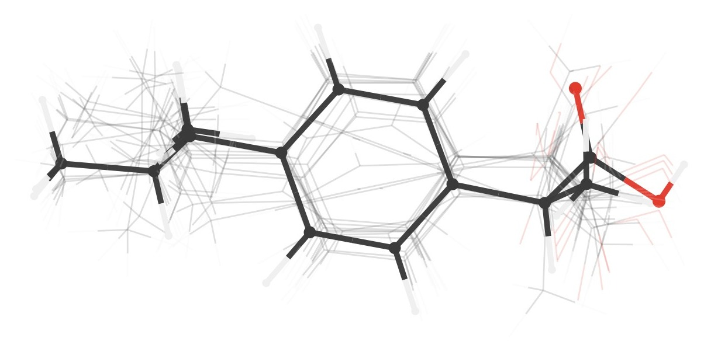

<div align="center">

# ConformerMPhysChem



**Conformer generation, ensemble analysis, and MLIP refinement — from SMILES to a near-DFT-quality ensemble on a local CPU.**

</div>

---

## ✨ Overview

**ConformerMPhysChem** is a local application (Streamlit) and Python library for
**generating conformer ensembles** of organic molecules, **analysing** them (energies,
Boltzmann populations, RMSD, geometry), and **refining** them with **machine-learned
interatomic potentials (MLIPs)** — yielding high-quality relative energies **in minutes**,
with no compute-cluster queue or cloud credits.

The architecture is modular: generation backends, the analysis layer, and the MLIP
refiner communicate through a single data contract (`EnsembleResult`), with every energy
expressed in **kcal/mol**.

## ✨ Key features

- **Generation** from **SMILES, SDF, or XYZ** (RDKit backend; optional OpenConf backend).
- **Full analysis**: absolute energy, ΔE, **Boltzmann weights (%)**, heavy-atom RMSD to the
  minimum, radius of gyration, and SASA.
- **MLIP refinement in minutes** on the CPU, via geometry optimisation (LBFGS) or single-point:
  - **AIMNet2** — trained on DFT reference data at **ωB97M-D3/def2-TZVPP**; reproduces relative
    conformer energies with errors typically **< 1 kcal/mol**, covering **neutral and charged** species.
  - **MACE-OFF** — trained at **ωB97M-D3(BJ)/def2-TZVPPD**; delivers **near-chemical accuracy
    (~1 kcal/mol)** for energies and geometries of organic molecules.
- **Real-time convergence** monitoring (energy and maximum force, with the `fmax` threshold).
- **Automatic deduplication** of conformers that collapse onto the same minimum (symmetry-aware best-RMSD).
- **Interactive 3D visualisation** with RMSD-aligned superposition.
- **Export** to CSV and SDF; **light/dark theme**.

> The MLIP backends are gas-phase / implicit-solvent potentials: they **sharpen relative
> energies** but do not replace the conformational search, nor an explicit DFT optimisation
> where one is required.

## 📦 Installation

Requires **Python ≥ 3.12**. Using [uv](https://docs.astral.sh/uv/) is recommended.

```bash
git clone https://github.com/fatioleg/conformerlab.git
cd conformerlab/conformerlab        # package directory (contains pyproject.toml)
uv sync                              # installs all dependencies (RDKit, ASE, MACE, AIMNet2…)
```

<details>
<summary>Alternative with <code>pip</code></summary>

```bash
cd conformerlab/conformerlab
python -m venv .venv && source .venv/bin/activate
pip install -e .
```
</details>

> **MLIP refinement runs on CPU without a C++ compiler.** `torch.compile`/TorchDynamo is
> disabled automatically, so installing `g++`/build-essential is not required.

## ▶️ Running the application

```bash
cd conformerlab/conformerlab
uv run streamlit run app/app.py
```

Open the address shown (by default `http://localhost:8501`).

## 🧪 Quick tutorial (GUI)

1. **📂 Load** — enter a **SMILES** string (an example is pre-filled), or upload an
   **SDF/XYZ** file. Inspect the 2D/3D structure and molecular properties.
2. **⚙️ Generate** — choose the preset (`rapid`, `ensemble`, `docking`, `macrocycle`), the
   maximum number of conformers, and the energy window. Click **Generate**.
3. **📊 ConformerGen** — explore the table (ΔE, Boltzmann %, RMSD, Rg), the relative-energy
   chart, and the **3D viewer** with RMSD-aligned superposition. Filter by ΔE, weight, or RMSD.
4. **⚡ Refine MLIP** — select the **method** (AIMNet2 / MACE-OFF), the **mode** (geometry
   optimisation or single-point), how many conformers to refine (**top-N by energy**), the
   `fmax` threshold, and the **deduplication** RMSD. Click **Refine**: progress and **real-time
   convergence** appear above the tabs and, upon completion, the **table** (including the
   *Original rank* column), the **downloads** (CSV/SDF), and the **3D superposition** appear
   automatically.

## 🐍 Library usage

```python
from conformerlab.core.types import MoleculeInput, GenerationSettings, RefinementSettings
from conformerlab.backends.factory import get_backend
from conformerlab.analysis.pipeline import analyze
from conformerlab.refine.mlip import refine_with_mlip

# 1) Generate
mol = MoleculeInput(smiles="CC(C)Cc1ccc(cc1)C(C)C(=O)O")  # ibuprofen
backend = get_backend("rdkit")
ensemble = backend.generate(mol, GenerationSettings(preset="ensemble", max_conformers=50))
ensemble = analyze(ensemble)                       # ΔE, Boltzmann, RMSD, geometry

# 2) Refine the 10 lowest-energy conformers with MACE-OFF, removing replicas
settings = RefinementSettings(method="mace-off", max_conformers=10, dedup_rmsd=0.125)
refined = refine_with_mlip(ensemble, settings)
refined = analyze(refined)                          # recompute ΔE/Boltzmann on the refined set

for r in sorted(refined.records, key=lambda x: x.energy_kcal):
    print(r.conf_id, round(r.energy_kcal, 3), "kcal/mol", r.mlip_method)
```

Every energy is in **kcal/mol**. Backends return an `EnsembleResult`; analysis is
non-destructive, and MLIP refinement returns a **new** ensemble (the original is preserved).

## 🗂️ Project layout

```
conformerlab/
├─ app/                     # Streamlit application (app.py) + icon
└─ src/conformerlab/
   ├─ core/                 # types, units, molecule, errors (data contract)
   ├─ backends/             # RDKit, OpenConf — ConformerBackend interface
   ├─ analysis/             # energy, boltzmann, rmsd, geometry, align, pipeline
   ├─ refine/               # mlip.py — calculator registry + refinement
   └─ io/                   # CSV/SDF/XYZ/JSON export
Examples/                   # example molecules and outreach material
```

### Extending the MLIP backends

Any ASE-compatible calculator can be registered — including a shim for cloud GPU
(e.g. Modal.com) — without touching the rest of the code:

```python
from conformerlab.refine.mlip import register_calculator
register_calculator("my-mlip", lambda device: MyASECalculator(device=device))
```

## ✅ Tests

```bash
cd conformerlab/conformerlab
uv run pytest -q          # full suite
uv run ruff check src/ tests/
```

## 📑 Scientific conventions

Unit conventions, the backend contract, and the definition of done are documented in
[`conformerlab/AGENTS.md`](conformerlab/AGENTS.md); architecture decisions in
[`conformerlab/DECISIONS.md`](conformerlab/DECISIONS.md) and the history in
[`conformerlab/CHANGELOG.md`](conformerlab/CHANGELOG.md).

---

<div align="center">
<sub>The DFT levels cited are the reference training sets of the models
(AIMNet2: ωB97M-D3; MACE-OFF23: ωB97M-D3(BJ)). Actual accuracy is system-dependent;
"in minutes" depends on molecule size, the number of conformers, and the CPU.</sub>
</div>
